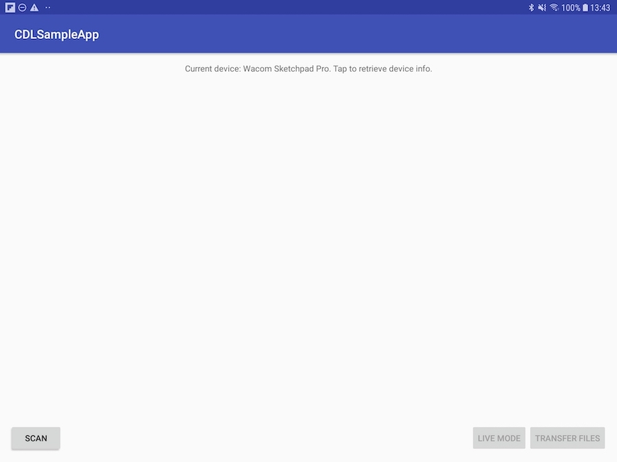

# Getting Started 

## Development Environment

The sample has been provided for Android devices.

To build and run the sample application you will need a device with Android 4.3 or above.

To test the application use a Wacom device such as a Bamboo Slate, Folio, Intuos Pro or PHU-111 Clipboard.

## Download the WILL SDK

Download the SDK from https://developer.wacom.com/developer-dashboard

* login using your Wacom ID
* Select **Downloads for devices**
* Download **Wacom Ink SDK for devices for Android**
* Accept the End User License Agreement to use the SDK

## Download an Evaluation License

A license is needed to use the SDK and a fully functional evaluation license is free to download as follows:

* Navigate to https://developer.wacom.com/developer-dashboard
* login using your Wacom ID
* Select **Licenses**
* Select **New Evaluation License**
* Select **Generate Evaluation License** for Wacom Ink SDK for devices
* Return to Licenses where the new license file is ready for download
* Download the license file

The license is supplied as a JWT text string in a text file. This will need to be copied into your application. The self-service evaluation licenses have a three-month expiry date from the time of creation. However you can generate a new license at any time. 


## Build the Sample Application

* Clone this repository onto your computer 
* Open Android Studio
* Either press "Open an Existing Android Studio Project" or click File > Open...
* Navigate to WillDevicesSampleApp. Press Choose, or OK
* Wait for the Gradle execution to complete. You should see "app" appear as a build configuration
* Add the downloaded SDKs as modules to the project.
* You can do this by File > New > New Module > Import .JAR/.AAR Package
* Make sure to include them in the settings.gradle file as well.
* Build the project and check there are no errors 
* Insert the downloaded evaluation license as follows:
    * Open the downloaded license txt file and copy the string
    * In Android Studio, navigate to app > assets > license.lic
    * Replace the <<your-license-here>> with your copied license string

      
Run the application to display the main window:

    

* Connect a suitable Wacom device to the PC - for example a Bamboo Slate, Folio or PHU-111 Clipboard
* Click [Scan for Devices]
* A list of available devices will be displayed
* Select the device name to connect to the device 
* Select [Real Time Ink] to display the pen trace in real-time or [Transfer File] to transfer ink documents from the device.


# Demo Application

## 1. Scan, Connect and Get Properties

### 1.1 Initialize License

You will need a valid license, issued for your application and having the needed features enabled in order to use the SDK. The easiest way to initialize your license is to add it as an asset to your application and then verify it using ```LicenseBootstrap```.

```java
AssetManager assetManager = getAssets();
try {
    InputStream license = assetManager.open("license.lic");
    LicenseBootstrap.initLicense(this.getApplicationContext(), LicenseBootstrap.readFully(license));
} catch (IOException | LicenseTokenException e) {
    e.printStackTrace();
}
```

### 1.2. Scan for Wacom Ink Devices

In order to find the available Wacom Ink Devices that are around we need to scan for them. To do this we need to create a new instance of ```InkDeviceScanner```. It will scan for Wacom Ink Devices over bluetooth. The devices should be in pairing mode in order to be found.  
* **Note:** To enter pairing mode on a Wacom SmartPad you need to press and hold the button on the device for 6 seconds.*

The constructor of the  ```InkDeviceScanner``` takes one parameter - context.

```java
InkDeviceScanner inkDeviceScanner = new InkDeviceScanner(this);
```

To start scanning for devices, what you need to do is to call the ```scan()``` method of the ```InkDeviceScanner```. It takes a single parameter - a callback through which it reports the devices that were found.

When the scanner finds a device, it is reported as ```InkDevice```. This object provides useful information such as devices's name and address. 

```java
inkDeviceScanner.scan(new InkDeviceScanner.Callback() {
      @Override
      public void onDeviceFound(InkDeviceInfo inkDeviceInfo) {
          ...
      }
});
```

When you are finished with the scanning, you should stop the scanner.

```java
inkDeviceScanner.stop()
```

### 1.3. Create New Ink Device

After a device was found from the scanner you can move on to creating an instance of ```InkDevice```. It is used to communicate with and execute commands on the Wacom Ink Device. ```createClient``` takes two parameters - context and InkDevice. ```InkDevice``` should usually be created via the dedicated ```InkDeviceFactory```. The ```createClient``` method takes two parameters - context and inkDeviceInfo - the information which helps it create the right type of client for the Ink device and connect to it. If you have already paired with a device before there is no need to scan for it again. You can just serialize the ```InkDeviceInfo``` and reuse it to recreate the the client.

```java
inkDevice = InkDeviceFactory.createClient(this, inkDeviceInfo);
```

When you have finished you job with the ink device, or if you need to create a new client, you should first dispose it:

```java
inkDevice.dispose();
```

### 1.4. Connect to Wacom Ink Device

After creating the InkDevice, you need to connect to it, in order to be able do be able to communicate with it further on it.  
The ```connect``` method takes three parameters:  

* ```InkDeviceInfo``` - the information about the device (found during scan or persisted from previous usages).
* ```appId``` - a unique identifier of the application. It is used by the Ink devices to pair with the application.
* ```ConnectionCallback``` - the callback through which to be notified once the connection was successfully established.  


```java
inkDevice.connect(inkDeviceInfo, appId, new ConnectionCallback() {
      @Override
      public void onConnected() {
          ...
      }
});
```

### 1.5. Device Services

There are certain things that each Wacom Ink Device can do and in the most cases they differ from one to another. In the SDK these features are grouped into sets called Device Services. To get the feature sets of the currently connected Ink device you can use the method ```getAvailableDeviceServices()```, which will return a ```List``` of ```DeviceServiceTypes```.    

```java
ArrayList<DeviceServiceType> availableDeviceServices = inkDevice.getAvailableDeviceServices();
```

Therefore, you can easily check if the Device Service you are interested in (for example - ```File Transfer Service```) is available:  

```java
availableServices.contains(DeviceServiceType.FILE_TRANSFER_DEVICE_SERVICE)
```

Some of the Device Services (such as ```FileTransferDeviceService``` and ```LiveModeDeviceService```) cannot work in parallel - if one of them is enabled, the other cannot be started until the first one is stopped.  
However, Device Services like ```EventDeviceService``` can work while there is another enabled service.   
```EventDeviceService``` provides the means to subscribe for and receive events sent by the device. Examples for such events are changes in the battery state, or when the device expects a certain action from the user - for example pressing the button on the Ink Device.  
To be able to receive these events you should first of all check if ```EventDeviceService``` is available and if so - to execute its ```subscribe``` method, passing a callback through which events will be dispatched later on. There are three main types of events you will receive:  

* ```Event``` - the basic event, broadcasted by the Ink device (e.g. change of the battery state).  
* ```UserActionExpected``` - when a user action is expected by the user.  
* ```UserActionCompleted``` - tells you that the user action previously requested is now completed (either successfully or not).

```java
if(inkDevice.getAvailableDeviceServices().contains(DeviceServiceType.EVENT_DEVICE_SERVICE)){
      ((EventDeviceService) inkDevice.getDeviceService(DeviceServiceType.EVENT_DEVICE_SERVICE)).subscribe(new EventCallback() {
            @Override
            public void onEvent(InkDeviceEvent event, Object value) {
                  ...
            }

            @Override
            public void onUserActionExpected(UserAction userAction) {
                  ...
            }

            @Override
            public void onUserActionCompleted(UserAction userAction, boolean success) {
                  ...
            }
      });
}
```

Ink devices have properties which describe some of there characteristics such as its name, battery state, id and other. You can easily acquire them using the ```getProperties``` method, passing a ```List``` of the properties you are interested in. As a result, in the callback, you should receive a TreeMap with property type - value pairs. The tree map keeps the same order as the list. However, if a parameter is not supported by the current Ink Device it will be omitted.  


```java
List<InkDeviceProperty> properties = Arrays.asList(InkDeviceProperty.values());

inkDevice.getProperties(properties, new GetPropertiesCallback() {
      @Override
            public void onPropertiesRetrieved(TreeMap<InkDeviceProperty, Object> properties) {
                  ...
            }
      });
```


### 1.6. Device Alerts

Alerts are unexpected events that may lead to different behavior of the InkDevice. Subscribe to them in order to be able to maintain a proper communication with the InkDevice.

```
inkDevice.subscribe(new AlertsCallback() {
    @Override
    public void onAlert(InkDeviceAlert alert) {
        ....
    }
});
```


## 2. FileTransfer - Transfer Files From Ink Device

In this part, we want to receive and preview all the files created with the Wacom Ink Device. To do so, after making sure that the ```FileTransferDeviceService``` is supported by the current device, we should get its instance:

```java
FileTransferDeviceService fileTransferDeviceService = (FileTransferDeviceService) inkDevice.getDeviceService(DeviceServiceType.FILE_TRANSFER_DEVICE_SERVICE);
```

and enable it:


```java
fileTransferDeviceService.enable(new FileTransferCallback() {
            @Override
            public boolean onFileTransferred(InkDocument inkDocument) {
                ...
            return true;
            }
      });
```

through the callback, you will receive the ```InkDocuments``` containing layered Ink data.

## 3. LiveMode - Get Real Time Inking


At this step, we would like to receive the data created on the Ink Device in real time.  
Again the first thing to do is make sure that this feature is supported by the device.  
Then we are ready to get the instance of the ```LiveModeDeviceService```:


```java
LiveModeDeviceService liveModeDeviceService = (LiveModeDeviceService) inkDevice.getDeviceService(DeviceServiceType.LIVE_MODE_DEVICE_SERVICE);
```

and enable it:

```java
liveModeDeviceService.enable(new LiveModeCallback() {
      @Override
      public void onStrokeStart(PathChunk pathChunk) {
        ...
      }

      @Override
      public void onStrokeMove(PathChunk pathChunk) {
        ...
      }

      @Override
      public void onStrokeEnd(PathChunk pathChunk, InkStroke inkStroke) {
        ...
      }

      @Override
      public void onNewLayerCreated() {
        ...                  
      }

});
```

As you can see, there are three callbacks through which you can receive data in real time:  


* onStrokeStart - A new stroke was started.  
* onStrokeMove - The previously started stroke is now continued.  
* onStrokeEnd - The stroke was finished. Notice that contrary to the previous two methods, this one also provides as a parameter ```InkStroke``` - containing the data describing the whole stroke.
* onNewLayerCreated - A new layer was created.


## 4. Rendering documents

**WILL SDK for Ink** provides a 2D drawing engine which focuses primarily on inking. It uses OpenGL 2.0 (or newer) and is compatible with the Android OS, which uses EGL/OpenGL for 2D/3D graphics rendering.
A WILL **InkCanvas** can be bound to either an Android ```SurfaceView``` or an Android ```TextureView```. In this example we will use a SurfaceView, as this option offers superior performance during compositing. For more information on the Android Graphics architecture, see the official Android documentation.
**Note** for more in-depth examples of Will Ink Rendering, see the documentation and samples:  
[WILL SDK for Ink - Rendering](http://developer-docs.wacom.com/sdk-for-ink/docs/2.0.0/rendering)


###  Step 1: Setting up the Ink Engine - SurfaceView
In order to render the documents from a Wacom tablet to an Android tablet. Create a drawing surface by using Android's SurfaceView class which provides a dedicated drawing surface embedded inside the View hierarchy, add a SurfaceHolder.Callback interface to its SurfaceHolder instance, and implement its methods:

```java
@Override
protected void onCreate(Bundle savedInstanceState) {

    ....
    final SurfaceView surfaceView = (SurfaceView) findViewById(R.id.surfaceView);
    surfaceView.getHolder().addCallback(new SurfaceHolder.Callback(){
        @Override
        public void surfaceChanged(SurfaceHolder holder, int format, int width, int height) {
            ...
        }

        @Override
        public void surfaceCreated(SurfaceHolder holder) {

        }

        @Override
        public void surfaceDestroyed(SurfaceHolder holder) {
            ....
        }
    });
```

### Step 2: Create a canvas to draw on
The ***InkCanvas*** class is the core of the WILL SDK for Ink **Rendering** module. It is responsible for the management of the allocated OpenGL resources and can only be used on an OpenGL thread.

Create an ***InkCanvas*** instance when a surface is available. Release the canvas's allocated OpenGL resources when the EGL context is lost, or when the rendering surface provided by the Android framework is destroyed or recreated.

An ***InkCanvas*** instance can be created with one of the following factory methods:

 - ```InkCanvas.create()```
 - ```InkCanvas.create(SurfaceHolder, EGLRenderingContext.EGLConfiguration)```


In this case, use ```InkCanvas.create(SurfaceHolder, EGLRenderingContext.EGLConfiguration)``` so that an EGL rendering context will be created, applied, and dedicated to this canvas only:

```java
@Override
public void surfaceChanged(SurfaceHolder holder, int format, int width, int height) {
    if (inkCanvas!=null && !inkCanvas.isDisposed()){
        releaseResources();
    }

    inkCanvas = InkCanvas.create(holder, new EGLConfiguration());

    ...
}

@Override
public void surfaceDestroyed(SurfaceHolder holder) {
    releaseResources();
}
```
The thread that this method is called from (the UI thread) becomes the OpenGL thread.
### Step 3: Create a method to dispose of the canvas
Since an InkCavas instance can only be used on the thread from which it was initialized, you must release the InkCanvas instance's allocated OpenGL resources if the EGL context is going to be lost, or the rendering surface provided by the Android framework is going to be destroyed or recreated.

Define the ```releaseResources()``` method to dispose of the canvas, finalizing it properly and making it safe for garbage collection:
```java
private void releaseResources(){
    inkCanvas.dispose();
}
```

### Step 4: Create an instance of pathBuilder
Create an instance called _pathBuilder_ using the ```SpeedPathBuilder``` class, which produces paths with variable width depending on the speed of the user's input. Place it in the ```onCreate``` method.
```java
pathBuilder = new SpeedPathBuilder(getResources().getDisplayMetrics().density);
pathBuilder.setNormalizationConfig(100.0f, 4000.0f);
pathBuilder.setPropertyConfig(PropertyName.Width, 5f, 10f, 5f, 10f, PropertyFunction.Power, 1.0f, false);
pathStride = pathBuilder.getStride();
```
### Step 5: Create and initialize layers to render the stroke
A **Layer** represents storage for graphics (pixels) that can be updated, drawn to other layers, or presented on screen. To draw a stroke onto an InkCanvas, you must first draw it into a layer.

Use the ```inkCanvas.createViewLayer()``` method to create and initialize a layer (viewLayer), binding it to the default OpenGL framebuffer (the framebuffer provided by the window system). Below 

```java
@Override
public void surfaceChanged(SurfaceHolder holder, int format, int width, int height) {
    ...
    inkCanvas = InkCanvas.create(holder, new EGLConfiguration());
    
    viewLayer = inkCanvas.createViewLayer(width, height);
    strokesLayer = inkCanvas.createLayer(width, height);
    currentFrameLayer = inkCanvas.createLayer(width, height);

    inkCanvas.clearLayer(currentFrameLayer, Color.WHITE);
    ...
}
```
  - viewLayer is bound to the default framebuffer (the default OpenGL framebuffer provided by the window system). Everything drawn into this layer is presented to the screen.
  - strokesLayer contains all drawn strokes.
  - currentFrameLayer contains the currently rendered frame, which should be copied to viewLayer when the rendering is complete.
 
**Note:** All layer creation calls should be made on the GL thread (the thread from which the WILL engine has been initialized). In this case, this is the UI thread.
### Step 6: Create a brush to use when drawing strokes
Use a **SolidColorBrush** instance to draw strokes with a solid color:
```java
brush = new SolidColorBrush();
```
The **SolidColorBrush** is more accurate for paths that vary sharply in width than the faster **directBrush**.
### Step 7: Create an instance to store transient stroke information between successive draw calls
Create a **StrokePaint** instance to hold information about how the strokes should be drawn:
```java
paint = new StrokePaint();
paint.setStrokeBrush(brush);    // Solid color brush.
paint.setColor(Color.BLUE);     // Blue color.
paint.setWidth(Float.NaN);      // Expected variable width.
```
Each ***StrokePaint*** instance can be treated as a stroke rendering configuration: it holds all the information required by the WILL SDK for Ink **Rasterizer** module to draw a path, in the form of a stroke, into a specified ***InkCanvas***: it holds the previously created ***SolidColorBrush*** instance (called brush), a color, the stroke width, and the stroke start cap and end cap flags. You will set the beginning and ending caps later, when you draw the parts of the stroke.

In the code above, ```paint.setWidth(Float.NaN)``` indicates that the stroke will be drawn with variable width.

Finally create an instance of the ***StrokeRenderer*** class, which encapsulates dirty area clean-up and rendering optimization techniques, allowing fast and smooth stroke drawing.
```java
strokeRenderer = new StrokeRenderer(inkCanvas, paint, pathStride, width, height);
```

### Step 8: Draw the strokes
Define a ```drawStrokes(...)``` method to be responsible for the stroke composition:
```java
    private void drawStrokes() {
        inkCanvas.setTarget(strokesLayer);
        inkCanvas.clearColor();

        for (Stroke stroke: strokesList){
            paint.setColor(Color.RED);
            strokeRenderer.setStrokePaint(paint);
            strokeRenderer.drawPoints(stroke.getPoints(), 0, stroke.getSize(), stroke.getStartValue(), stroke.getEndValue(),true);
            strokeRenderer.blendStroke(strokesLayer, stroke.getBlendMode());
        }

        inkCanvas.setTarget(currentFrameLayer);
        inkCanvas.clearColor(Color.WHITE);
        inkCanvas.drawLayer(strokesLayer, BlendMode.BLENDMODE_NORMAL);
    }
```
This method is called on every received document.

The ```drawStrokes(...)``` method above shows an example usage of the ***StrokeRenderer*** class, which provides a simplified mechanism to draw strokes on an ***InkCanvas***. It draws the last built partial path points into an internally maintained layer of the ***StrokeRenderer*** instance using the ```strokeRenderer.drawPoints(...)``` method. Then the newly generated stroke part is blended into _currentFrameLayer_.
### Step 9: Extract the strokes from an inkDocument
You will need to extract to strokes from an inkDocument in order to draw them on the screen. Define a method like this:
```java
    private void extractStrokes(InkDocument inkDocument) {
        strokesList.clear();
        Iterator<InkNode> iterator = inkDocument.iterator();

        while (iterator.hasNext()){
            InkNode node = iterator.next();
            if (node instanceof InkStroke) {
                InkStroke inkStroke = (InkStroke) node;
                Stroke stroke = new Stroke();
                stroke.copyPoints(inkStroke.getPoints(), 0, inkStroke.getSize());
                stroke.setStride(inkStroke.getStride());
                stroke.setWidth(inkStroke.getWidth());
                stroke.setBlendMode(inkStroke.getBlendMode());
                stroke.setInterval(inkStroke.getStartValue(), inkStroke.getEndValue());
                stroke.setColor(inkStroke.getColor());
                strokesList.add(stroke);
            }
        }
    }
```
Where ```strokesLists``` is a _LinkedList_ of type **Stroke** (see the example app for more information).

### Step 10: Present strokes on screen
Modify the ```renderView()``` method to overwrite _viewLayer_ with the contents of _currentFrameLayer_, presenting the contents on screen:
```java
private void renderView() {
    inkCanvas.setTarget(viewLayer);
    inkCanvas.drawLayer(currentFrameLayer, BlendMode.BLENDMODE_OVERWRITE);
    inkCanvas.invalidate();
}
```
### Step 11: Dispose of the StrokeRenderer instance when no longer needed
Update the ```releaseResources()``` method to dispose of the **StrokeRenderer** instance when the OpenGL resources are released:
```java
private void releaseResources(){
    strokeRenderer.dispose();
    inkCanvas.dispose();
}
```

### How to save the inkDocument to a jpeg/png? 
You can save the inkDocument to a png for example while using ```inkCanvas.readPixels``` method. Here's an example of the whole implementation:
```java
    private void saveBitmap(){
        Bitmap bmp = Bitmap.createBitmap(canvasWidth, canvasHeight, Bitmap.Config.ARGB_8888);
        inkCanvas.readPixels(currentFrameLayer, bmp, 0, 0, 0,0, canvasWidth, canvasHeight);

        String file = Environment.getExternalStorageDirectory().toString() + "/will-offscreen.png";

        FileOutputStream out = null;

        try {
            out = new FileOutputStream(file);
            bmp.compress(Bitmap.CompressFormat.PNG, 100, out);
            } catch (Exception e) {
            e.printStackTrace();
            } finally {
            try {
                if (out != null) {
                    out.close();
                }
                } catch (IOException e) {
                e.printStackTrace();
                }
            }
    }
```


----

        


