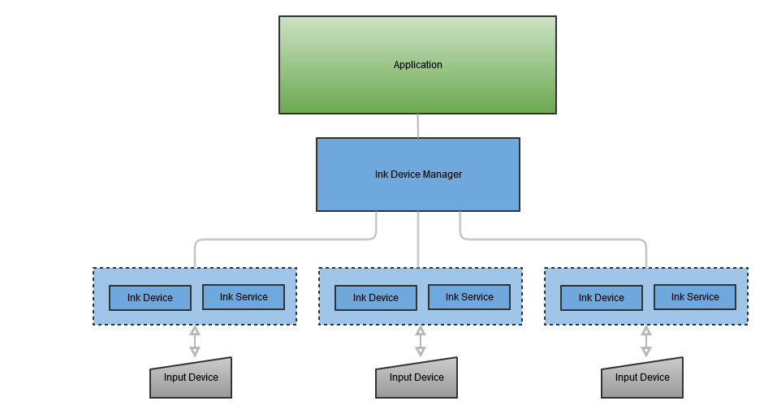

# Wacom Ink SDK for devices - Android

> **NB: This series of Wacom products is now discontinued and support for them is no longer offered.**

## Introduction

---

The Wacom Ink SDK for devices incorporates the *Common Device Library* (CDL) supplied as a single library that can handle different types of pen or touch input from Wacom and third-party devices.
The benefits of using the CDL include:

* Less implementation effort for developers: integration of a single library gives support for a range of input devices
* The flexibility to include support for non-Wacom devices in an application
* The freedom to take full advantage of the *Wacom Ink Technologies* digital ink ecosystem to provide high quality digital ink rendering without sacrificing the value of raw pen data needed in processes such as signature verification
* A generic interface relieves the application code from direct control of the connected hardware

Using the library you can:

* Search for available devices
* Connect to a device
* Receive input from a connected device in the WILL Ink format

The CDL is available for a range of development platforms

* Windows (Classic and UWP)
* iOS
* Android

Types of supported devices include:

* Wacom PHU-111 Clipboard
* Wacom Smartpad e.g. Folio, Slate
* Wacom Intuos
* Apple Pencil

Regardless of the development platform and device type a consistent approach is provided for application development:



### Ink Device Manager
    Use the device manager to receive a list of named devices that are available for connection
### Ink Device
    Connect to a named device and retrieve properties
### Ink Service
    Use the service callback mechanism to receive data from the connected device.
    Depending on the type of device, data can be in the form of realtime pen strokes, or a file transfer of a completed page.

To view operation of the CDL diagrammatically:


## SDK Overview

---

To illustrate the Wacom Ink SDK for devices, the samples which follow are taken from the Android version of the SDK. A similar approach is followed on all platforms where sample projects are supplied as part of the SDK.

### 1. Initialize License
You will need a Wacom Ink SDK for devices license, issued for your application. The easiest way to initialize your license is to add it as an asset to your application and then verify it using ```LicenseBootstrap```.

```java
AssetManager assetManager = getAssets();
try {
    InputStream license = assetManager.open("license.lic");
    LicenseBootstrap.initLicense(this.getApplicationContext(), LicenseBootstrap.readFully(license));
} catch (IOException | LicenseTokenException e) {
    e.printStackTrace();
}
```

### 2. Scan for Wacom Ink Devices

In order to find the available Wacom Ink Devices start a scan. To do this create a new instance of ```InkDeviceScanner```. It will scan for Wacom Ink Devices over bluetooth. The devices should be in pairing mode in order to be found.
* **Note:** To enter pairing mode on a Wacom SmartPad press and hold the button on the device for 6 seconds.*

The constructor of the  ```InkDeviceScanner``` takes one parameter: *context*.

```java
InkDeviceScanner inkDeviceScanner = new InkDeviceScanner(this);
```

To start scanning for devices, call the ```scan()``` method of the ```InkDeviceScanner```. It takes a single parameter - a callback through which it reports the devices that were found.

When the scanner finds a device, it is reported as ```InkDevice```. This object provides useful information such as the devices's name and address.

```java
inkDeviceScanner.scan(new InkDeviceScanner.Callback() {
      @Override
      public void onDeviceFound(InkDeviceInfo inkDeviceInfo) {
          ...
      }
});
```

When scanning is complete you should stop the scanner.

```java
inkDeviceScanner.stop()
```

### 3. Create New Ink Device

After a device was found from the scanner create an instance of ```InkDevice```. It is used to communicate with and execute commands on the Wacom Ink Device. ```createClient``` takes two parameters: *context* and *InkDevice*. ```InkDevice``` should usually be created via the dedicated ```InkDeviceFactory```. The ```createClient``` method takes two parameters: *context* and *inkDeviceInfo* - the information which helps it create the right type of client for the Ink device and connect to it. If you have already paired with a device before there is no need to scan for it again. You can just serialize the ```InkDeviceInfo``` and reuse it to recreate the the client.

```java
inkDevice = InkDeviceFactory.createClient(this, inkDeviceInfo);
```

When you have finished with the ink device, or if you need to create a new client, you should first dispose it:

```java
inkDevice.dispose();
```

### 4. Connect to Wacom Ink Device

After creating the InkDevice, you need to connect to it.
The ```connect``` method takes three parameters:

* ```InkDeviceInfo``` - the information about the device (found during scan or persisted from previous usages).
* ```appId``` - a unique identifier of the application. It is used by the Ink devices to pair with the application.
* ```ConnectionCallback``` - the callback through which to be notified once the connection was successfully established.


```java
inkDevice.connect(inkDeviceInfo, appId, new ConnectionCallback() {
      @Override
      public void onConnected() {
          ...
      }
});
```

### 5. Device Services

There are certain things that a Wacom Ink Device can do but in most cases there are differences between one device and another. In CDL these features are grouped into sets called Device Services. To get the feature sets of the currently connected Ink device you can use the method ```getAvailableDeviceServices()```, which will return a ```List``` of ```DeviceServiceTypes```.

```java
ArrayList<DeviceServiceType> availableDeviceServices = inkDevice.getAvailableDeviceServices();
```

Therefore, you can easily check if the Device Service you are interested in (for example - ```File Transfer Service```) is available:

```java
availableServices.contains(DeviceServiceType.FILE_TRANSFER_DEVICE_SERVICE)
```

Some of the Device Services (such as ```FileTransferDeviceService``` and ```LiveModeDeviceService```) cannot work in parallel - if one of them is enabled, the other cannot be started until the first one is stopped.
However, Device Services like ```EventDeviceService``` can work while there is another enabled service.
```EventDeviceService``` provides the means to subscribe for and receive events sent by the device. Examples for such events are changes in the battery state, or when the device expects a certain action from the user - for example pressing the button on the Ink Device.
To be able to receive these events you should first of all check if ```EventDeviceService``` is available and if so, execute its ```subscribe``` method, passing a callback through which events will be dispatched later on. There are three main types of events you will receive:

* ```Event``` - the basic event, broadcast by the Ink device (e.g. change of the battery state).
* ```UserActionExpected``` - when a user action is expected by the user.
* ```UserActionCompleted``` - tells you that the user action previously requested is now completed (either successfully or not).

```java
if(inkDevice.getAvailableDeviceServices().contains(DeviceServiceType.EVENT_DEVICE_SERVICE)){
      ((EventDeviceService) inkDevice.getDeviceService(DeviceServiceType.EVENT_DEVICE_SERVICE)).subscribe(new EventCallback() {
            @Override
            public void onEvent(InkDeviceEvent event, Object value) {
                  ...
            }

            @Override
            public void onUserActionExpected(UserAction userAction) {
                  ...
            }

            @Override
            public void onUserActionCompleted(UserAction userAction, boolean success) {
                  ...
            }
      });
}
```

Ink devices have properties which describe some of their characteristics such as name, battery state, id and other. You can easily acquire them using the ```getProperties``` method, passing a ```List``` of the properties you are interested in. As a result, in the callback you should receive a TreeMap with property type - value pairs. The tree map keeps the same order as the list. However, if a parameter is not supported by the current Ink Device it will be omitted.


```java
List<InkDeviceProperty> properties = Arrays.asList(InkDeviceProperty.values());

inkDevice.getProperties(properties, new GetPropertiesCallback() {
      @Override
            public void onPropertiesRetrieved(TreeMap<InkDeviceProperty, Object> properties) {
                  ...
            }
      });
```


### 5.1. Device Alerts

Alerts are unexpected events that may lead to different behavior of the InkDevice. Subscribe to them in order to be able to maintain a proper communication with the InkDevice.

```
inkDevice.subscribe(new AlertsCallback() {
    @Override
    public void onAlert(InkDeviceAlert alert) {
        ....
    }
});
```


### 5.2. FileTransfer- Transfer Files From Ink Device

In this section, we want to receive and preview all the files created with the Wacom Ink Device. To do so, after making sure that the ```FileTransferDeviceService``` is supported by the current device, we should get its instance:

```java
FileTransferDeviceService fileTransferDeviceService = (FileTransferDeviceService) inkDevice.getDeviceService(DeviceServiceType.FILE_TRANSFER_DEVICE_SERVICE);
```

and enable it:


```java
fileTransferDeviceService.enable(new FileTransferCallback() {
            @Override
            public boolean onFileTransfered(InkDocument inkDocument) {
                ...
            return true;
            }
      });
```

through the callback, you will receive the ```InkDocuments``` containing layered Ink data.

### 5.3. LiveMode - Get Real Time Inking


In this section, we would like to receive the data created on the Ink Device in real time.
The first thing is to make sure that this feature is supported by the device.
Then we are ready to get the instance of the ```LiveModeDeviceService```:


```java
LiveModeDeviceService liveModeDeviceService = (LiveModeDeviceService) inkDevice.getDeviceService(DeviceServiceType.LIVE_MODE_DEVICE_SERVICE);
```

and enable it:

```java
liveModeDeviceService.enable(new LiveModeCallback() {
      @Override
      public void onStrokeStart(PathChunk pathChunk) {
        ...
      }

      @Override
      public void onStrokeMove(PathChunk pathChunk) {
        ...
      }

      @Override
      public void onStrokeEnd(PathChunk pathChunk, InkStroke inkStroke) {
        ...
      }

      @Override
      public void onNewLayerCreated() {
        ...
      }

});
```

There are three callbacks through which you receive data in real time:


* onStrokeStart - A new stroke was started.
* onStrokeMove - The previously started stroke is now continued.
* onStrokeEnd - The stroke was finished. Notice that contrary to the previous two methods, this one also provides as a parameter ```InkStroke``` - containing the data describing the whole stroke.
* onNewLayerCreated - A new layer was created.

---


# Additional resources 

## Sample Code
For further samples check Wacom's Developer additional samples, see [https://github.com/Wacom-Developer](https://github.com/Wacom-Developer)

## Documentation
For further details on using the SDK see [Wacom Ink SDK for devices documentation](http://developer-docs.wacom.com/sdk-for-devices/) 

The API Reference is available directly in the downloaded SDK.

## Support
If you experience issues with the technology components, please see the related [FAQs](https://developer-support.wacom.com/hc/en-us)

For further support file a ticket in our **Developer Support Portal** described here: [Request Support](https://developer-support.wacom.com/hc/en-us/requests/new)

## Developer Community 
Join our developer community:

- [LinkedIn - Wacom for Developers](https://www.linkedin.com/company/wacom-for-developers/)
- [Twitter - Wacom for Developers](https://twitter.com/Wacomdevelopers)

## License 
This sample code is licensed under the [MIT License](https://choosealicense.com/licenses/mit/)

---

